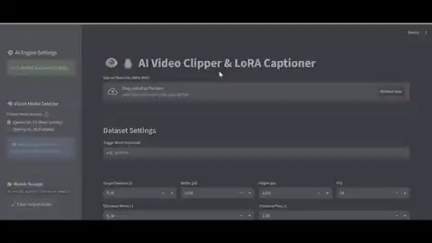

# 👁️🐧 AI Video Clipper & LoRA Captioner (v3.7)



**The ultimate automated dataset creation tool.**
*Auto-slicing, Transcribing, and Vision Captioning for LoRA/LyCORIS training.*

---

### 🏆 PROJECT CREDITS
* **[Cyberbol](https://github.com/cyberbol):** **Original Creator & Logic Architect.**
* **[FNGarvin](https://github.com/FNGarvin):** **System Architect.** (UV Engine & Linux Support).
* **[WildSpeaker7315](https://www.reddit.com/user/WildSpeaker7315/):** **Hardware Research.** (RTX 5090 Blackwell Fixes).

---

### ⚡ What's New in v3.7 (Project Manager Update)
* **🔄 Auto-Update Script:** New `update.bat` added! Keep your local files in sync with the latest GitHub improvements with a single click.
* **📂 Custom Project Names:** You can now name your dataset folder (e.g., "Batman_LoRA") instead of relying on default names.
* **📝 Bulk Video Captioning:** A new dedicated tab for captioning already existing video folders. No cutting needed, just pure AI description.
* **💎 Native Quality Toggle:** Keep original resolution and FPS for lossless datasets.
* **🚀 Instant UI Feedback:** New "Phase 1/2" status messages to monitor WhisperX initialization and analysis.

---

## 🚀 How to Use

### 🎥 1. Auto-Clipper
Upload a video, set your **Project Name**, and let the AI find segments based on speech. It will cut and describe each clip automatically.

### 📝 2. Bulk Video Captioner
Select a folder containing already cut `.mp4` or `.mkv` files. The AI will generate `.txt` files for every video using the Vision model.

### 🖼️ 3. Image Folder Captioner
Standard mode for bulk-captioning image folders.

---

## 🔄 How to stay updated
If you want to receive new features automatically:
1. Make sure you have **Git** installed.
2. Run **`update.bat`** in your main folder. It will pull the latest `app.py` and other fixes directly from this repository.

---

## ⚙️ Installation

### 🪟 Windows
1. Run `install.bat`.
2. Run `Run.bat`.

### 🐧 Linux / WSL
1. Open a terminal in the project folder.
2. Run the installer:
    ```bash
    ./install.sh
    ```
3. Start the app:
    ```bash
    ./run.sh
    ```

### ☁️ Cloud / RunPod
For those who prefer processing datasets on high-VRAM cloud GPUs, an illustrated [RunPod Deployment Guide](RUNPOD-HOWTO.md) is available to walk you through the setup.

---

## ⚙️ How to Use
1.  **Select Mode:** Choose between *Video Auto-Clipper* or *Image Folder Captioner*.
2.  **Choose Model:** Select **7B** (Quality) or **2B** (Speed) in the sidebar.
3.  **Custom Prompt (Optional):** In the sidebar, you can define how the AI should describe the scene (e.g., *"Focus on lighting and camera angle"*).
4.  **Upload Video / Select Folder.**
5.  **Click START.**

---
<div align="center">
  <b>Licensed under MIT - Built for the Community by Cyberbol</b>
</div>