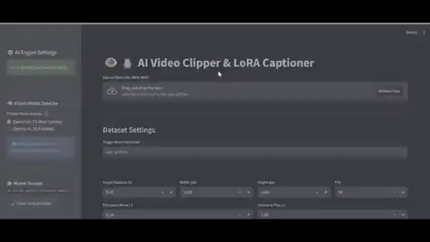

# 👁️🐧👂 AI Video Clipper & LoRA Captioner
**State of the Art dataset preparation tool for Video LoRA training (LTX-2, HunyuanVideo).**
*Now featuring Audio Intelligence, 3-Stage Pipeline, and Advanced Bulk Processing.*



## 🎯 Core Features

### 1. 🎥 Video Auto-Clipper
Upload a long video (e.g., a vlog or podcast). The AI will:
* Detect speech using **WhisperX** (Word-level precision).
* Cut the video into segments (e.g., 5-7 seconds).
* Analyze the visual content.
* (Optional) Analyze the background audio.
* Save pairs of `.mp4` and `.txt` files automatically.

### 2. 📝 Bulk Video Captioner
Have a folder full of raw clips? Point the app to it.
* Select **Vision**, **Speech**, or **Both**.
* The app will generate descriptions for every video file in the folder.

### 3. 🖼️ Image Folder Captioner
Standard mode for captioning datasets of images using powerful, vision-capable LLMs.

---

## ⚙️ Installation

### Prerequisites
* **NVIDIA GPU** 
    * Ampere (RTX 3xxx) or newer
    * Minimum 12GB VRAM recommended
    * MUST have driver support for CUDA 12.8 or higher
* **Windows 10/11** or **Linux**

### 🪟 Windows (One-Click)
1.  Run `Install.bat`.
    * *This script uses `uv` to create an isolated, conflict-free environment and installs all dependencies.*
2.  Run `Run.bat` to start the app.

### 🐧 Linux / WSL
1.  Run `./install.sh`.
2.  Run `./run.sh`.

### 🐳 Docker / Container
Ideally suited for headless servers or easy deployment.
1.  **Pull the Image**:
    ```bash
    docker pull ghcr.io/cyberbol/ai-video-clipper-lora:latest
    ```
2.  **Run with GPU Support**:
    ```bash
    docker run --gpus all -p 8501:8501 -v $(pwd):/workspace/projects ghcr.io/cyberbol/ai-video-clipper-lora:latest
    ```
    *(Note: Ensure you have the `nvidia-container-toolkit` installed on your host system).*

### ☁️ Cloud / RunPod
For those who prefer processing datasets on high-VRAM cloud GPUs, an illustrated [RunPod Deployment Guide](docs/RUNPOD-HOWTO.md) is available to walk you through the setup.

### 🛠️ Maintainers
For developers needing to support new CUDA versions or custom model architectures, refer to the [Custom Wheel Build Guide](docs/BUILD_WHEELS_HOWTO.md) for instructions on compiling `llama-cpp-python` from source.

---

## ⚠️ Important Notes

* **VRAM Usage:** Enabling "Audio Analysis" downloads an additional ~15GB model (Qwen2-Audio). The process will be slower as models are swapped in and out of GPU memory.
* **Models:** The app automatically downloads models to the `./models` folder.
* **RTX 5090 Support:** Includes patches for Blackwell architecture compatibility.

---

## 📜 Changelog

<details open>
<summary><b>v5.4 - Gemma 4 & Qwen3-VL Support</b></summary>

* **Gemma 4 12B and Qwen3-VL 8B** are now available as vision models, auto-downloaded the same way as the existing GGUF models. Gemma 4 is now the default.
* The vision engine now selects the correct model-specific chat handler instead of a one-size-fits-all LLaVA template - fixes garbled/truncated captions that showed up on these newer models under the old generic handler.
* Cleaned up the model picker (dropped the `GGUF:`/`Transformer:` label prefixes, reordered so the recommended models sort first).
* Bumped the attested `llama-cpp-python` wheels to v0.3.44+cu128 to pick up current Gemma/Qwen support.
* Assorted install/runtime hardening: fixed a silent CPU-fallback bug in GPU detection, a `cmd.exe` parser crash in `Install.bat`'s venv setup, and pinned `transformers`/`compressed-tensors` versions together to keep FP8 audio loading working.
</details>

<details>
<summary><b>v5.2 - Blackwell Detection & Installer Hardening</b></summary>

* **Fixed RTX 5090/Blackwell wheel detection on Windows:** a cmd.exe parser bug in `Install.bat` was silently falling back to the standard `llama-cpp-python` wheel on Blackwell GPUs instead of the CUDA-optimized build, with no error shown ([#13](https://github.com/cyberbol/AI-Video-Clipper-LoRA/issues/13)).
* Rewrote the GPU-detection logic on Windows, Linux, and inside the Docker image to be immune to this whole class of bug, and fixed matching (previously silent) failures in the Linux install path and the container's runtime hot-swap.
* **Added an automated regression test suite** (`tests/`) plus CI that verifies the correct wheel is installed for both pre- and post-Blackwell GPUs, on Windows, native Linux, and inside the Docker container.
* **`Install.bat` now recovers automatically** from a common school/corporate-network failure mode (TLS certificate revocation checks blocked by a proxy or firewall): if the wheel download fails specifically with that error, it retries once with revocation checking disabled, with a clear on-screen warning. The SHA256 checksum verification is unchanged and remains the real safety net either way.
</details>

<details>
<summary><b>v5.0 - The Modular Speed Update</b></summary>

* We have made the engine more modular and faster, allowing more agility in onboarding new models.
* Full support for Qwen3-VL, Gemma3, etc.
* Now, any gguf+mmproj pair in appropriate dir structure will be added to the UI. This allows users to pick quants for themselves to better suit their hardware.
    * *Note: This dependency does require Windows users to have the Visual C Runtimes.*
* **BRAND NEW DOWNLOAD ARCHITECTURE**
    * Now uses a standard, flat and human-readable dir structure compatible w/ other tools and UIs instead of the HuggingFace format.
    * *Note: Requires a one-time download refresh for users currently using transformers repos.*
    * Multithreaded, multi-connection downloads that don't depend on HuggingFace libs or logins.
* Added UI support for making text appear as it is generated.
* Now using `uv`-managed Python for "portable" installs.
* Added an "Advanced Options" shelf/panel UI w/ additional tuning parameters.
* Models with vision support but no video support are now supported through cutting frames w/ ffmpeg and moviepy.
* Now using **FP8** for the Qwen-Audio model to save several GBs of disk and VRAM use.
* Now verifying **SHA256 checksums** for key binary wheels.
</details>

<details>
<summary><b>v4.0 - Audio Intelligence Update</b></summary>

We have completely rewritten the core engine to support multi-modal understanding.

* **🎧 Audio Intelligence (Qwen2-Audio Support):** The app can now "listen" to your videos! It uses the Qwen2-Audio-7B-Instruct model to analyze background sounds, ambiance, and music (e.g., "In the background, wind is blowing and melancholic music is playing"). This is crucial for training advanced video models like LTX-Video that support audio generation.
* **🚀 3-Stage Pipeline Architecture:** To manage VRAM usage efficiently, the app now operates in strict phases:
    1.  **Speech Analysis:** (WhisperX) - Precise timestamping.
    2.  **Audio Event Analysis:** (Qwen2-Audio) - Description of environmental sounds.
    3.  **Visual Analysis:** (Qwen2-VL) - Detailed visual captioning. Memory is aggressively cleaned between stages to prevent OOM errors.
* **📦 Bulk Video Captioner 2.0:** Completely revamped! You can now toggle Vision Captioning and Speech Transcription independently. Process folders of existing clips with full AI power.
* **⚡ LTX Hard Cut Mode:** A new cutting mode designed for LTX-2 training. It ignores sentence boundaries and cuts clips to a strict duration (e.g., exactly 5.0s) from the start of detected speech, ensuring perfect tensor shapes for training.
* **🌊 Natural Flow Captions:** Rewritten prompt logic merges Visual descriptions, Audio atmosphere, and Speech into one fluid, natural paragraph instead of robotic tags.
</details>

<details>
<summary><b>Legacy Versions (History)</b></summary>

### v3.7 - Project Manager & Bulk Video
* Introduced Project Management features.
* Added initial Bulk Video processing capabilities.

### v3.2 - RTX 5090 Support
* Added support for NVIDIA Blackwell architecture (RTX 5090).
* Initial updates for compatibility.
</details>

---

## 🏆 Credits

* **[Cyberbol](https://github.com/cyberbol):** Original Creator & Logic Architect.
* **[FNGarvin](https://github.com/FNGarvin):** Engine Architect (Back-end Systems).
* **[WildSpeaker7315](https://www.reddit.com/user/WildSpeaker7315/):** He owns a 5090!
* **[JamePeng](https://github.com/JamePeng/llama-cpp-python):** For providing llama-cpp-python workflows and updates and for the latest models.

---
<div align="center">
  <b>Licensed under MIT - Built for the Community</b>
</div>


