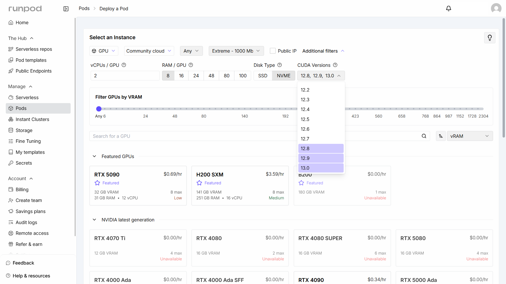
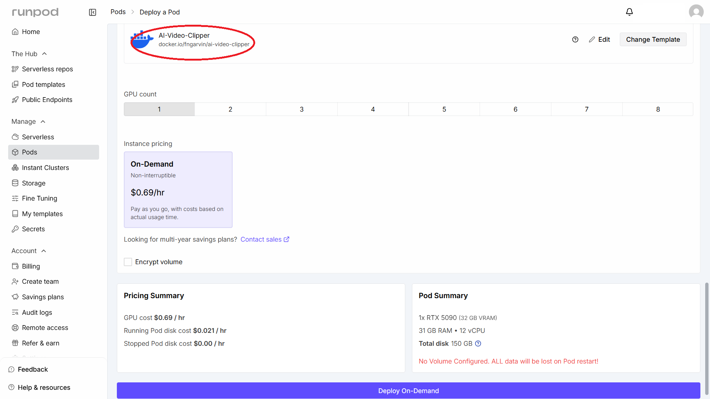
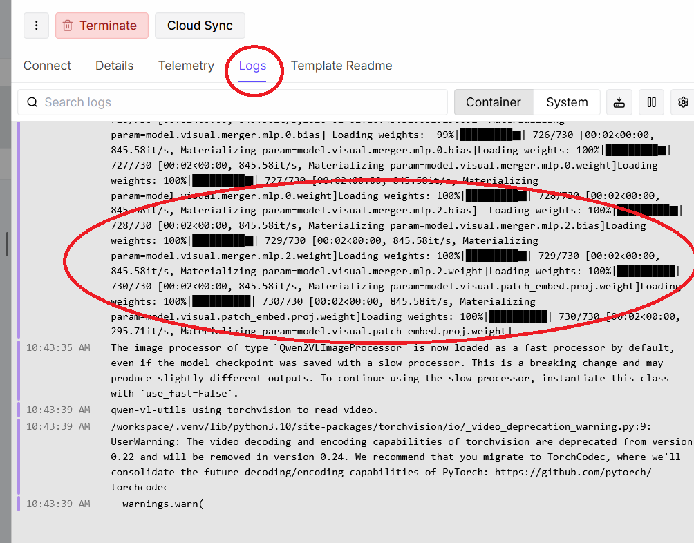
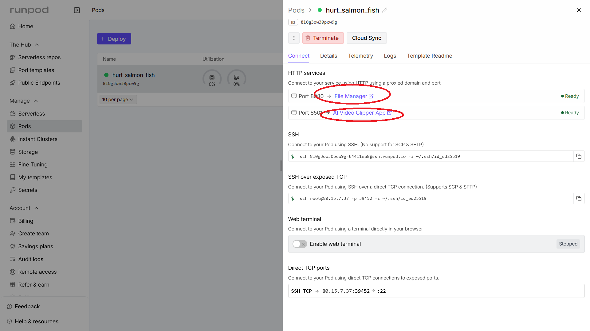
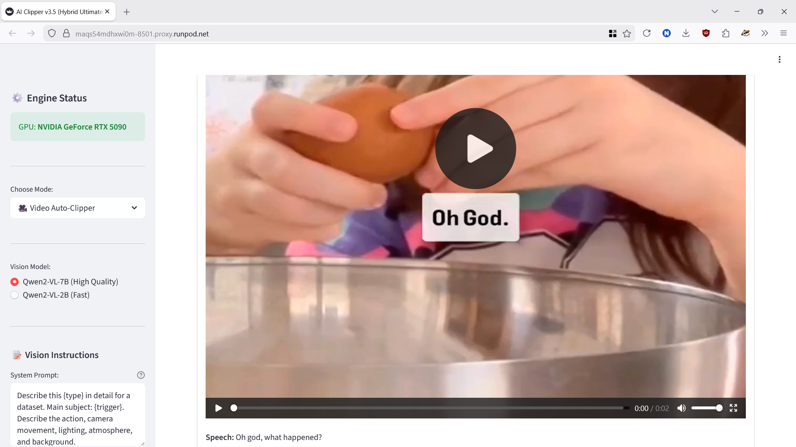
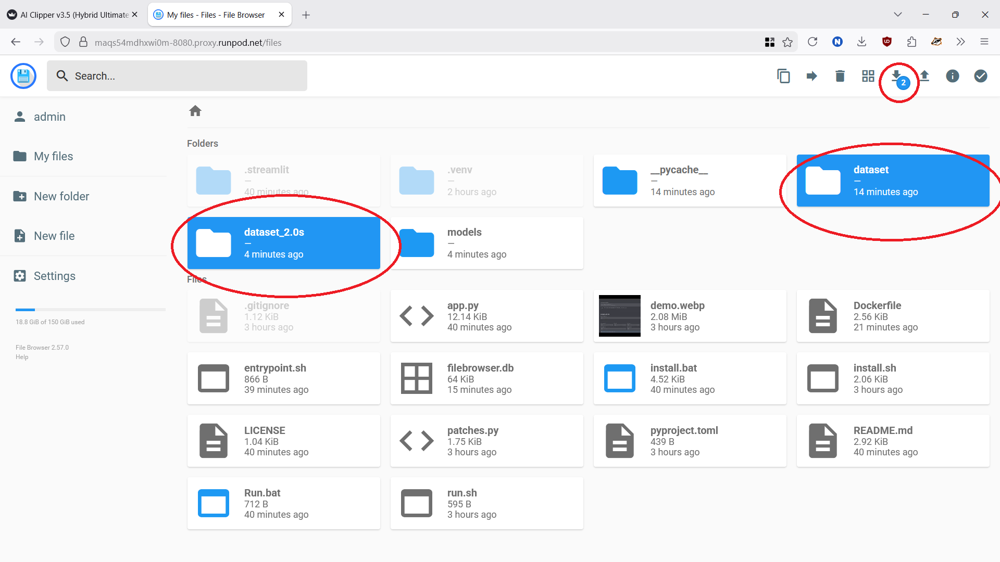

# ☁️ RunPod Deployment Guide: AI Video Clipper

Follow this guide to deploy the AI Video Clipper & LoRA Captioner on RunPod for high-performance cloud processing with data-center network speeds.

---

### 1. Configure GPU & CUDA Version
Choose a GPU and any parameters you prefer (e.g. location, network, etc.). 
> [!IMPORTANT]
> Ensure you select **CUDA 12.8 and/or higher** in the instance settings to ensure compatibility with the current PyTorch engines and vision models.

### 2. Select the Template
Search for and select the AI Video Clipper template.  The default parameters should be optimal for most use cases, but feel free to adjust them as desired.

Verify that the template, pricing summary, and Pod summary are all to your liking.  If so, click the blue **Deploy On-Demand** button at the bottom of the page.

### 3. (Optional) Monitor Deployment
While the pod initializes, you can monitor the progress by clicking the **Logs** tab. This is where you can see model downloads and any potential initialization errors.

### 4. Access the Application
Once the status is "Running," click the **Connect** button. You will see two primary HTTP services:
*   **Port 8501:** The AI Video Clipper App.
*   **Port 8080:** The File Manager.

### 5. Using the App
The Streamlit interface allows you to process your videos and generate captions exactly as you would locally.

### 6. Managing Datasets
Use the integrated **File Manager** to browse the workspace, upload raw videos, and download your processed datasets. 
*   You can download individual files or select entire folders to download as a `.zip` archive.
*   Processed datasets are typically stored in folders named by their cut duration (e.g., `dataset_2.0s`).

---

  <b>Managed Deployment via RunPod</b>

